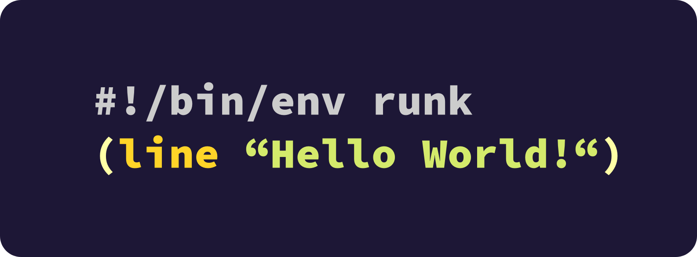
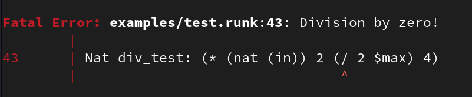

> Please do not confuse this with Ronald's Universal Number Kruncher

[](https://github.com/OndrejZobal/runk/actions/workflows/rust.yml)


# Ridiculously Useless Numeric Katastrophe
A scripting language and an interpreter. Runk can crunch numbers and handle basic logic.
Feel free to try it out, but I have to warn you... It's ~~useless~~ a work in progress.




## What is runk?
runk is a standard Unix utility that does math on all computers on Earth!


## How come I never heard of runk?
A guy named Ronald made runk on a different timeline where runk is used the most.
I thought we were missing out so I decided to make it here as well.

[Evidence of runk existing](https://twitter.com/6thgrade4ever/status/1433519577892327424)


## Can I use runk to do math on all computers on Earth?
Well, almost I guess. The only thing is that runk *currently* doesn't support any control
structures apart from `go` and `goif` and also doesn't do real numbers or have any form of
a list. But hey they landed on the moon with only 2GB of ram (or something... I don't know I
am too busy working on runk to know these *fun facts*) so it shouldn't stop you.


# How to build
To get you up and running with the freshest builds of runk just make sure you have `cargo`
installed and then type `cargo build --release`. And your static and optimized build
should be waiting for you in `target/release/runk`.

If you are ok with a product that's bit stale, you can see the releases and get it there.


# What works
The interpreter is not yet fully implemented, but some things already work. You can
have a look at my [test file](examples/test.runk) everything in this file should
always work and the interpreter should exit with 0.

Here is an example of fibonacci sequence in runk.

``` runk
Int max: 1000
Int n1: 1
Int n2: 0
Int helper: 0
Nat order: 1

!loop                                               # A lable to return to at the beginning of every iteration.
(line $order "th Fibonacci number is" $n2 "!")      # Prints previous number.
helper: $n1                                         # Saving current number to herlper
n1: (+ $n1 $n2)                                     # Sets current number to: current number + previous number
n2: $helper                                         # Copyies helper into previous number
order: (+ $order 1)                                 # Increment order.
(goif (< $n2 $max) $lable)                          # Jumps if condition is not equal to zero.

(line "And that's it!")
```

Runk also has some really nice error reporting is I may say so myself.



See the [full program](examples/fibonacci/fibonacci.runk)!

Or look at other [examples](examples/).

* * *

# Usage
Give it a path to a `.runk` source file and runk will be happy to run it.
You can also shove the `.runk` file down the standard input
and it should also work.


## Syntax
I don't know what I should say here because you probably already figured it out by now.


### Variables and assignment
Basically you can assign values to variables like this: `<type> <variable-name>: <value>`.
You don't have to mention the type again after you have already defined it once.

You cannot redefine a variable with a different type.

#### Types
Currently runk has four types:
 - `Nat`: Natural number
 - `Int`: Integer
 - `Txt`: Text
 - `Lab`: Label


### Values
Values can be obtained from writing literals or calling functions.

#### Literals
There are three types of literals in runk right now. These allow you to create
a value from all types and are as follows:
 - `Nat` and `Int`: A word containing only digits (in case of an `Int` can also begin with a minus). Example: `123`
 - `Txt`: Any sequence of characters surrounded by double-quotes on both sides. Special escape sequences are
 not yet supported. Text literals can span multiple lines. Example: `"Hello World"`
 - `Lab`: A word prefixed with an exclamation mark. Note a lone label on a line is a label definition. Example `!loop`

#### Variable References
You can get a value of an existing variable by prefixing the variable name with a dollar sign.

#### Function Calls
A function call is surrounded by an opening and a closing bracket. The first word in a function call is the function name
all other words after that are arguments and can be anything that resolves to a value include another function call.

```runk
(function-name argument-1 argument-2 argument-n)
```

Runk currently does not support creation of custom function during runtime.
All functions are hard-coded.

Functions in runk can support either limited or unlimited number of arguments and
may only want values of a specific type.

#### Outputting
If any value is returned and not assigned to any variable, it will be sent to standard output.


### Function Replacement
Some functions can fail, this will usually result in the program exiting but
it doesn't have to. I you anticipate that a function might fail you can use the "else"
token to specify a function replacement action. This action can either be another
function call who's return value will be assigned in place of the original
function, or a label in which case the interpreter will immediately jump to this label
without completing the assignment.

You can chain as many function replacements as you would like.

```runk
!input
"Enter an integer: "
Int value: (int (in)) else !input

Nat num: (/ 1 0) else (/ 4 (- 2 2)) else (* 2 2)
```

See the [full list of functions](docs/function-list.md).


### Spanning multiple lines
> What was opened must be closed.
>   - The Entrance stone

In runk commands are separated by new lines, however if you don't close all your functions
runk will treat all following lines as a continuation of that command until all functions
are closed.

```runk
(+
    (+ 100 100)
    (- 200 300)
    (*
        10
        20
        30
    ) (/ 10 7)
    (not 1)
)
```


### Comments
You can use the hash symbol to comment out the rest of the line

```runk
# Hmmmm... Interesting...
(lines "Answer:" (+ 27 15)) # Yes Indeed.
```

